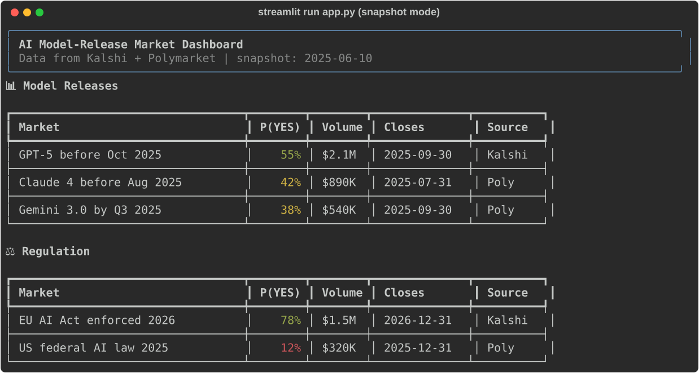

# AI Model-Release Market Dashboard

Streamlit dashboard aggregating prediction markets about AI: model releases, regulation, capability milestones, and corporate events. Ships with a snapshot for instant demo.

[](LICENSE)
[](https://www.python.org/downloads/)

> ⚠️ **Data may be delayed. Not financial/trading advice.**



## Features

- **4 categories** — Model releases, Regulation, Capability, Corporate
- **Market cards** — question, P(YES), volume, resolve date, source link
- **Filters & sorting** — by category, probability, volume, or close date
- **Offline demo** — `data/snapshot.json` committed for demo without API keys

## Install

```bash
pip install -e .
```

## Quickstart

```bash
# Run with bundled snapshot (no API keys needed)
streamlit run app.py
```

The dashboard opens at `http://localhost:8501` with data from `data/snapshot.json`.

The current app reads the bundled snapshot only. API keys in `.env` do not enable live fetching. Restart the app or clear Streamlit's data cache after replacing the snapshot.

## How It Works

1. **Load** — reads and validates the UTF-8 market snapshot
2. **Curate** — categorizes markets by keyword rules (model release, regulation, capability, corporate)
3. **Display** — Streamlit renders filterable, sortable market cards with probability highlights

The app loads `data/snapshot.json`, which is also included in the installed wheel so the Python snapshot loader works outside the checkout. The committed data is demo data and can be stale.

## Architecture

```
app.py                     # Streamlit entry point
data/snapshot.json         # Pre-fetched market snapshot for offline demo
src/aimarkets/
├── fetch.py               # Snapshot loading and saving
├── curate.py              # Category classification + sorting
└── models.py              # Market data models
```

## Roadmap

- [ ] Live market fetching
- [ ] Auto-refresh with configurable interval
- [ ] Historical price charts per market
- [ ] Alerts for large probability moves
- [ ] Additional sources (Metaculus, Manifold)

## License

MIT
